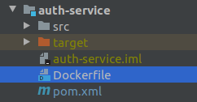

# SPRING IN DOCKER COMPOSE

### 1. pom.xml

    В <project></project> добавить <name>auth-service</name>
    В build - plugins - plugin - spring-boot-maven-plugin добавить configuration как в примере внизу

```xml
    <build>
        <plugins>
            <plugin>
                    <groupId>org.springframework.boot</groupId>
                    <artifactId>spring-boot-maven-plugin</artifactId>
                    <configuration>
                        <finalName>auth-service</finalName>
                    </configuration>
                </plugin>
        </plugins>
    </build>
```

### 2.    Docker

    Создать Dockerfile в папке с сервисом



    С следуюшим содержанием 

```docker
FROM java:8-jre # image и версия

ADD ./target/auth-service.jar /app/ # Добавить в образ jar file
CMD ["java", "-Xmx200m", "-jar", "/app/auth-service.jar"] # Запуск jar внутри обража, Xmx200m ограничение по памяти

EXPOSE 8761 # Порт микросервися

```

### 3. Docker compose

    Тут надо создать два файла docker-compose.dev.yml и docker-compose.yml.
    В docker-compose.dev.yml мы описываем как собираем образы, и как их запускать в docker-compose.yml.
    Примеры
    1)

```docker
    version: '2.2'
    services:
        auth-service:
            build: auth-service # Название папки где лежит Dockerfile
            ports:
            - 8761:8761
```
    2)

```docker
    version: '2.2'
    services:
        auth-service:
            environment:
                ENV1: $ENV1
                ENV2: $ENV2
            image: path-to-registry/auth-service:latest
            restart: always
```

### Как работать в докер

    Посмотри видео 
[Видео на youtube](https://www.youtube.com/playlist?list=PLD5U-C5KK50XMCBkY0U-NLzglcRHzOwAg)

### Для запуска

```bash
    docker-compose -f  docker-compose.dev.yml -f docker-compose.yml up
    # или c -d для запуска в фоновом режиме
    docker-compose -f  docker-compose.dev.yml -f docker-compose.yml up -d
```